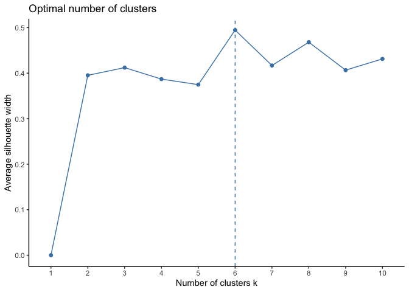

FMX Project
================

# Question

- do technical factors, combined with fundamentals factors generate
  superior risk adjusted return if are combined into an investment
  portfolio.

# Goal

the goal of the this project would be to implement a portfolio that
enhances diversification (by orthogonal risk source), generate above
market-relative returns, and decrease risk.

Enroute to achieving the main goal I need to deal with the following : -
investigate the different momentum measures and their efficacy in order
for us to reach a reasonable conclusion on which measure is best for my
clustering purposes.

# Proposed Data & Methodology

- use a technique to cluster group of stock using similar techinical
  drivers and some fundamental drivers.

- perform a transformation on historical prices to obtain price
  derivatives such as momentum and volatility. These are 200D moving
  average, 12 month return (momentum ), 100D trailing SD. Fundamnetal
  data considered will be ROIC, EBIT and EV.

- pre process the data by applying a percentile scoring relative to the
  factors.

- Apply K-means (the base model, attractive because of its simplicity
  clustering to group stocks by quality, value and volatility.

- Conduct a return and risk attribution to each clusters by back
  testing. Re-balancing quarterly, this would be my outsample testing

- Filter each clusters stocks by the top 5 (this depends on the size of
  the factors) relative momentum values).

# Cleaning the data

# using PC analysis then clustering to get an idea of building a portfolio

- in the write up mention the advantages from text about k means
  clustering, then from that mention how those can be applied to
  finance.

- explain the silhoute in the methodology, what k means tries to acheive
  and how, good clusters and bad clusters?

- deriving meaning out of the clusters.

<!-- -->

    ##        percentile_rank_vol percentile_rank_momen
    ## ABG.JO           26.666667             21.666667
    ## ANG.JO           16.666667             16.666667
    ## BIK.JO           80.000000             73.333333
    ## EQU.JO           90.000000             86.666667
    ## FFA.JO            3.333333             53.333333
    ## GFI.JO           50.000000             30.000000
    ## GLN.JO           56.666667             36.666667
    ## HAR.JO           46.666667            100.000000
    ## HMN.JO           66.666667             60.000000
    ## KAP.JO           70.000000             33.333333
    ## KBO.JO          100.000000              3.333333
    ## MCG.JO           73.333333             43.333333
    ## MRP.JO           10.000000             46.666667
    ## MTM.JO           60.000000             76.666667
    ## NPH.JO           96.666667             26.666667
    ## ORN.JO           30.000000             10.000000
    ## OUT.JO           20.000000             56.666667
    ## PAN.JO           33.333333             83.333333
    ## PIK.JO           36.666667              6.666667
    ## PPC.JO           83.333333             95.000000
    ## QLT.JO           53.333333             90.000000
    ## RMH.JO           86.666667             95.000000
    ## SAP.JO           43.333333             80.000000
    ## SBK.JO           13.333333             70.000000
    ## SOL.JO           40.000000             13.333333
    ## TCP.JO           93.333333             63.333333
    ## TFG.JO           23.333333             40.000000
    ## TRU.JO            6.666667             50.000000
    ## VKE.JO           76.666667             66.666667
    ## WHL.JO           63.333333             21.666667

<!-- --><!-- -->
\# Cluster perfromance characteristics & Backtesting

I will now look at cluster performance charcateristics, performance over
different investmnet horizons, drawdowns using an equally weighted
portfolio and a capped portfolio.

- rebalance quarterly (Wednesdays of Mar, Jun, Sep and Dec)
- sector agnostic
- no turnover over constraints
- use a market weighted capped index for our backtesting
- with 4 clusters, silhouette score still high enough for good clusters
  and each clusters have over 10 stocks, enough for our use case.

## Caveats

we got 6 momentum and 12 month vol numbers to get the attribution. Its
not really comparing apples to apples but its back testing to see how
that group may has performance given our criteria. You can decide wheter
its reasonable.

second, I continue to use daily returns.

to get more out of this I will try to use a market cap index.

``` r
# merge the cluster information to the original dataset 

attribution_data <- cluster.merging 

monthly_attribution <-
attribution_data %>% rename(rtn = ret)

months <- c("Mar", "Jun", "Sep", "Dec")

# now, lets extract a cluster and check out its performance 

rebalance_weights <- cluster_rebalancing_weights(monthly_attribution, months, "Wed")
```

``` r
df_Cons <- rebalance_weights 

 W_Cap = 1

Cap <-  df_Cons %>% 
    # Split our df into groups (where the groups here are the rebalance dates:
    group_split(YM, cluster) %>% 
    
    # Apply the function Proportional_Cap_Foo to each rebalancing date:
    map_df(~Proportional_Cap_Foo(., W_Cap = W_Cap) ) %>% select(-YM)
 
# use the Capped_df and monthly_attribution dfs to step through this function

# create a list, in this list we select from cluster 1 to N, apply the function below which creates a portfolio, then combine this list into a single data frame for comparison 
 
Cluster_Port <- list()

# Loop over clusters
for (cluster_num in unique(Cap$cluster)) {
  # Subset Cap and monthly_attribution for the current cluster
  Cap_cluster <- filter(Cap, cluster == cluster_num)
  monthly_cluster <- filter(monthly_attribution, cluster == cluster_num)
  
  # Apply Cluster_Portfolio function
  result <- Cluster_Portfolio(Cap_cluster, monthly_cluster, cluster_num)
  
  # Add the result to the list
  Cluster_Port[[as.character(cluster_num)]] <- result
}
```

    ## Warning: `tbl_df()` was deprecated in dplyr 1.0.0.
    ## ℹ Please use `tibble::as_tibble()` instead.
    ## ℹ The deprecated feature was likely used in the tbl2xts package.
    ##   Please report the issue at <https://github.com/nicktz/tbl2xts/issues>.
    ## This warning is displayed once every 8 hours.
    ## Call `lifecycle::last_lifecycle_warnings()` to see where this warning was
    ## generated.

    ## Warning in tbl2xts::tbl_xts(., cols_to_xts = rtn, spread_by = stock): NOTE:......... 
    ##  Changed your data.frame object to tbl_df(). 
    ##  If results are strange, use a tbl_df class and check column definitions (character, numeric, etc make sense before using tbl_xts.)

    ## Warning in tbl2xts::tbl_xts(., cols_to_xts = rtn, spread_by = stock): NOTE:......... 
    ##  Changed your data.frame object to tbl_df(). 
    ##  If results are strange, use a tbl_df class and check column definitions (character, numeric, etc make sense before using tbl_xts.)

    ## Warning in tbl2xts::tbl_xts(., cols_to_xts = rtn, spread_by = stock): NOTE:......... 
    ##  Changed your data.frame object to tbl_df(). 
    ##  If results are strange, use a tbl_df class and check column definitions (character, numeric, etc make sense before using tbl_xts.)

    ## Warning in tbl2xts::tbl_xts(., cols_to_xts = rtn, spread_by = stock): NOTE:......... 
    ##  Changed your data.frame object to tbl_df(). 
    ##  If results are strange, use a tbl_df class and check column definitions (character, numeric, etc make sense before using tbl_xts.)

    ## Warning in tbl2xts::tbl_xts(., cols_to_xts = rtn, spread_by = stock): NOTE:......... 
    ##  Changed your data.frame object to tbl_df(). 
    ##  If results are strange, use a tbl_df class and check column definitions (character, numeric, etc make sense before using tbl_xts.)

    ## The spread_by column only has one category. 
    ## Hence only the column name was changed...

    ## Warning in tbl2xts::tbl_xts(., cols_to_xts = rtn, spread_by = stock): NOTE:......... 
    ##  Changed your data.frame object to tbl_df(). 
    ##  If results are strange, use a tbl_df class and check column definitions (character, numeric, etc make sense before using tbl_xts.)

    ## The spread_by column only has one category. 
    ## Hence only the column name was changed...

``` r
Portfolio <- Cluster_Port %>% reduce(inner_join, "date") %>% gather(Cluster, return, -date)

# plot 
Portfolio %>%
  group_by(Cluster) %>%
  mutate(Idx = cumprod(1 + return)) %>%
  ggplot(aes(date, Idx, color = Cluster)) +
  geom_line() +
  labs(title = "Capped Cluster Return On Investment",
       subtitle = "",
       x = "",
       y = "Cumulative Return") +
  fmxdat::theme_fmx()
```

    ## Warning in loadfonts_win(quiet = quiet): OS is not Windows. No fonts registered
    ## with windowsFonts().

<!-- -->
\## Return Attribution

Next I want to get some summary statistics for the portfolios.

- Annual vol
- Max DD
- Gain to Pain
- Annualized Return
- Sharpe ratio

``` r
# get some stats on the portfolios that you just constructed
Ports <- Portfolio %>% tbl2xts::tbl_xts(cols_to_xts = return, spread_by = Cluster, Colnames_Exact = T)

# now for the function to gather to give some stats on performance 

BMxts <- getSymbols('^J203.JO', src = "yahoo", from = "2014-01-01", to = Sys.Date(), auto.assign = TRUE)
```

    ## Warning: ^J203.JO contains missing values. Some functions will not work if
    ## objects contain missing values in the middle of the series. Consider using
    ## na.omit(), na.approx(), na.fill(), etc to remove or replace them.

``` r
BM <- Cl(getSymbols.yahoo('^J203.JO', auto.assign = FALSE)) %>% tbl2xts::xts_tbl() %>% rename(BM = J203.JO.Close) %>% 
  mutate(rtn = BM /lag(BM)-1) %>% select(-BM) %>% mutate(YM = format(date, "%y %m")) %>% group_by(YM) %>% 
  filter(date == last(date)) %>% tbl2xts::tbl_xts()
```

    ## Warning: ^J203.JO contains missing values. Some functions will not work if
    ## objects contain missing values in the middle of the series. Consider using
    ## na.omit(), na.approx(), na.fill(), etc to remove or replace them.

    ## Warning in tbl2xts::tbl_xts(.): NOTE: The tbl_df grouping was not preserved. Output same as with ungroup(df). 
    ##  You can choose to use spread_by instead.

``` r
BM[is.na(BM)] <- 0

BMxts <- BM

nrow(Ports)
```

    ## [1] 119

``` r
nrow(BMxts)
```

    ## [1] 144

``` r
Fundxts <- Ports

Months_LookBack <- 10
NA_Check <- 0.8

# a function to get moments 


Moments_Comp <- function(funds, BM, Months_LookBack, NA_Check){
  
library(PerformanceAnalytics)
    
  Moms <- 
      bind_rows(
        data.frame(Return.cumulative(Fundxts) ) %>% round(., 3),
        data.frame(Return.annualized(Fundxts, scale = 12, geometric = T)) %>% round(., 3),
        data.frame(PerformanceAnalytics::Return.annualized.excess(Fundxts, BMxts) ) %>% round(., 3),
        data.frame(sd.annualized(Fundxts, scale = 12, geometric = T)) %>% round(., 3),
        
        data.frame(PerformanceAnalytics::AdjustedSharpeRatio(Fundxts) ) %>% round(., 3),
        data.frame(PainIndex(Fundxts, scale = 12, geometric = T)) %>% round(., 3),
        data.frame(AverageDrawdown(Fundxts, scale = 12)) %>% round(., 3),
        
         data.frame(TrackingError(Ra = Fundxts, Rb = BMxts, scale = 12)) %>% round(., 3), 
         data.frame(PerformanceAnalytics::InformationRatio(Ra = Fundxts, Rb = BMxts)) %>% round(., 3),
         data.frame(PerformanceAnalytics::CAPM.beta(Ra = Fundxts, Rb = BMxts, Rf = 0)) %>% round(., 3),
         data.frame(PerformanceAnalytics::CAPM.beta.bull(Ra = Fundxts, Rb = BMxts, Rf = 0)) %>% round(., 3),
         data.frame(PerformanceAnalytics::CAPM.beta.bear(Ra = Fundxts, Rb = BMxts, Rf = 0)) %>% round(., 3),
         data.frame(PerformanceAnalytics::UpDownRatios(Ra = Fundxts, Rb = BMxts, method = "Percent", side = "Up")) %>% round(., 3),
         data.frame(PerformanceAnalytics::CVaR(R = Fundxts, p = 0.05, method = "modified")) %>% round(., 3)
        ) %>% 
        
        tibble::rownames_to_column("Info") %>%
        mutate(Period = glue::glue("Last {Months_LookBack} Months"), Info = c("Cum Returns", "Returns (Ann.)", "Returns Excess (Ann.)", "SD (Ann.)", "Adj. Sharpe Ratio", "Pain Index", 
                                                 "Avg DD", "Tracking Error", "Information Ratio", "Beta", "Beta Bull", "Beta Bear", "Up-Down Ratio", "Modified CVaR")) %>% 
        relocate(Period, .before = Info) %>% as_tibble() 
  
  # This line replaces the `.` with a space.
  # Note the forward slashes, as `.` there means everything, `\\.` means a full-stop
  colnames(Moms) <- gsub("comp_rtn_", "Portfolio ", colnames(Moms))
  
  Moms
  }
  
Moments_Comp(Ports, BMxts, 10)
```

    ## ES calculation produces unreliable result (inverse risk) for column: 6 : -0.698735133477299

    ## # A tibble: 14 × 8
    ##    Period         Info   `Portfolio 1` `Portfolio 2` `Portfolio 3` `Portfolio 4`
    ##    <glue>         <chr>          <dbl>         <dbl>         <dbl>         <dbl>
    ##  1 Last 10 Months Cum R…         2.90          4.27          1.09         -1    
    ##  2 Last 10 Months Retur…         0.147         0.182         0.077       NaN    
    ##  3 Last 10 Months Retur…         0.149         0.184         0.079       NaN    
    ##  4 Last 10 Months SD (A…         0.239         0.34          0.244         1.20 
    ##  5 Last 10 Months Adj. …         0.604         0.581         0.318       NaN    
    ##  6 Last 10 Months Pain …         0.054         0.122         0.077         6.5  
    ##  7 Last 10 Months Avg DD         0.086         0.156         0.121         1.22 
    ##  8 Last 10 Months Track…         0.236         0.338         0.242         1.20 
    ##  9 Last 10 Months Infor…         0.648         0.557         0.344       NaN    
    ## 10 Last 10 Months Beta           0.645         1.06          0.761        -1.39 
    ## 11 Last 10 Months Beta …        -0.939        -0.461        -1.06         -9.06 
    ## 12 Last 10 Months Beta …         1.64          2.74          2.04         -2.68 
    ## 13 Last 10 Months Up-Do…         0.679         0.566         0.585         0.491
    ## 14 Last 10 Months Modif…        -0.117        -0.151        -0.134        -0.65 
    ## # ℹ 2 more variables: `Portfolio 5` <dbl>, `Portfolio 6` <dbl>

# What I aim to improve

I want to get some consistent results and maybe apply a methods of
backtesting the signal. I will explore other clustering models that can
give more consistent results and less ambiguity in the meaning of the
clusters.

- I want to cluster stock based on R-square, derived from regressing
  returns to PCs and/or factors.

- Use the results to cluster stock based R square to
